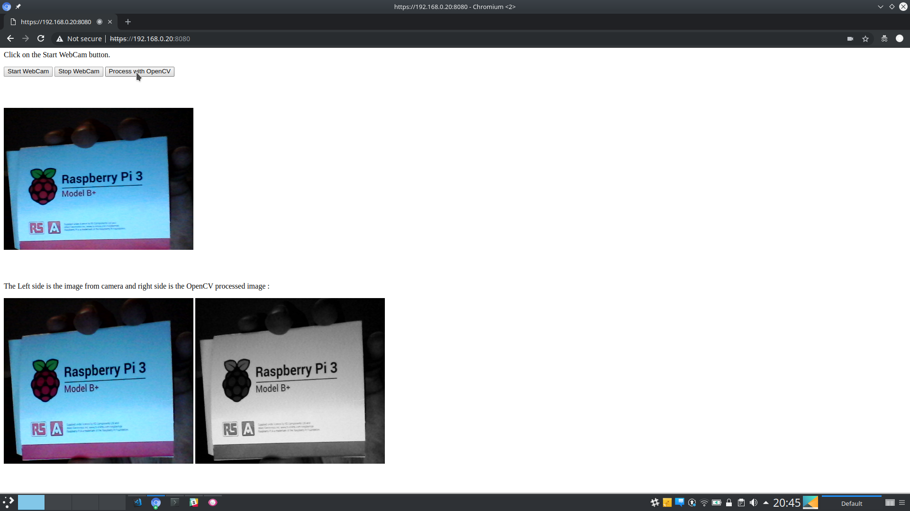

# Crossbar-OpenCV-Demo
This is a example code for connecting Crossbar(and autobahn) and opencv (python) together.

# Usage
```console
$ virtualenv -p python3 mypy
$ source mypy/bin/activate
$ pip install -r requirements.txt 
$ cd python 
$ crossbar start
```

# In Browser using HTTPS
The javascript uses getUserMedia API and this works only with HTTPS. 
So when you type your URL in browser always use https://IP_ADDRESS:8080 .

Demo output from Desktop



Demo output from Android SmartPhone
