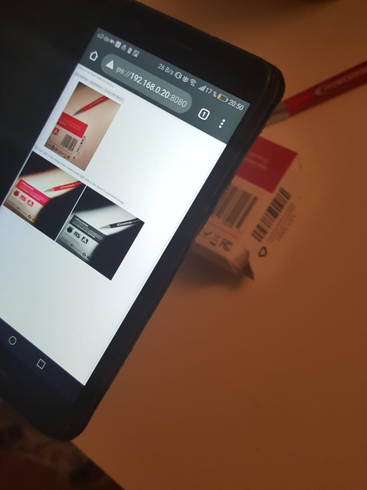

# Crossbar-OpenCV-Demo
This is a example code for connecting Crossbar(and autobahn) and opencv (python) together.

The Autobahn javascript that is running in the browser will send the base64 encoded camera image to the topic com.camera.image whenever you click "Process with OpenCV" button. The Autobahn python (subscriber )code on the other side will receive it and then the OpenCV will convert it to grayscale and publish to the topic com.camera.imagetrip. The javascript then receives the image and display it.


# Usage
```console
$ virtualenv -p python3 mypy
$ source mypy/bin/activate
$ pip install -r requirements.txt 
$ cd python 
$ crossbar start
```

# In Browser using HTTPS
The javascript uses getUserMedia API and this works only with HTTPS. 
So when you type your URL in browser always use https://IP_ADDRESS:8080 .

Demo output from Desktop


Demo output from Android SmartPhone
